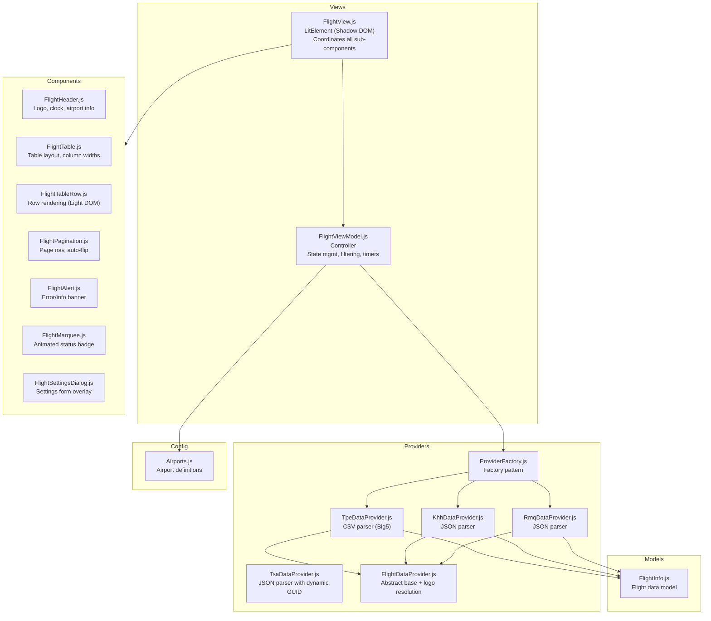

# OpenFIDS — Open-source Flight Information Display System

**OpenFIDS** is a real-time Flight Information Display System (FIDS) built as a pure front-end web application. It fetches live flight data directly from airport open-data APIs and renders a polished, auto-paginated flight board suitable for digital signage, information kiosks, or personal monitoring.

---

## Features

- **Real-time flight data** — Fetches live departure/arrival info from official airport open-data endpoints
- **Multi-airport support** — Switch between airports via URL hash or settings dialog
  - **TPE** — 臺灣桃園國際機場 (Taiwan Taoyuan International Airport)
  - **KHH** — 高雄國際機場 (Kaohsiung International Airport)
  - **RMQ** — 臺中國際機場 (Taichung International Airport)
  - **TSA** — 臺北松山機場 (Taipei Songshan Airport)
- **Departures & Arrivals** — Toggle between departure and arrival views
- **International & Domestic** — Supports both international and domestic flights where available
- **Auto-pagination** — Automatically flips pages on configurable interval; perfectly fits rows to screen height
- **Theme modes** — Dark, Light, or Auto (sunrise/sunset-based)
- **Full-screen mode** — Native browser fullscreen API for dedicated displays
- **Responsive design** — Adapts from mobile portrait to 4K TV landscape layouts
- **CORS proxy fallback** — Multiple proxy chains to bypass airport server restrictions
- **Airline logo fallback** — Automatically falls back to resolving airline logos via the public `iata-airelines-logos` repository if an airport lacks `logoBaseUrl`
- **URL-persistent state** — Airport, view type, route, time range, and theme are preserved in URL and localStorage

---

## Architecture

OpenFIDS is a **Lit-based Web Components** application with no framework dependency beyond Lit. It follows a clean layered architecture:



### Directory Structure

```text
code/
├── index.html                      # Entry point
├── package.json                    # Dependencies: lit, vite
├── vite.config.js                  # Vite build config (base: /OpenFIDS/)
└── src/
    ├── main.js                     # App bootstrap
    ├── assets/
    │   └── style.css               # Global styles, CSS variables, Light/Dark themes
    ├── config/
    │   └── Airports.js             # Airport configurations (code, coords, endpoints, logos)
    ├── models/
    │   └── FlightInfo.js           # Flight data model with computed properties
    ├── providers/
    │   ├── FlightDataProvider.js   # Abstract base provider + CORS proxy helper
    │   ├── TpeDataProvider.js      # TPE CSV parser (Big5 encoded)
    │   ├── KhhDataProvider.js      # KHH JSON parser
    │   ├── RmqDataProvider.js      # RMQ JSON parser
    │   └── ProviderFactory.js      # Factory: maps providerType → provider instance
    ├── views/
    │   ├── FlightView.js           # Main view: wires components together
    │   └── FlightViewModel.js      # ViewModel: state, fetch, filter, timers, sunrise/sunset
    └── components/
        ├── FlightHeader.js         # Airport code, clock, badge
        ├── FlightTable.js          # Scrollable table with pinned header
        ├── FlightTableRow.js       # Individual flight row (Light DOM)
        ├── FlightPagination.js     # Page controls, slider, auto-flip toggle
        ├── FlightAlert.js          # Dismissible alert banner
        ├── FlightMarquee.js        # Animated scrolling status badge
        └── FlightSettingsDialog.js # Settings form (airport, view, theme, time range)
```

---

## Data Sources

| Airport | IATA | Provider Type | Format | Endpoints |
|---------|------|--------------|--------|-----------|
| Taiwan Taoyuan | TPE | `TPE_CSV` | CSV (Big5) | Single URL for all flights |
| Kaohsiung | KHH | `KHH_JSON` | JSON | 4 URLs (intl_A, intl_D, dom_A, dom_D) |
| Taichung | RMQ | `RMQ_JSON` | JSON | 4 URLs (intl_A, intl_D, dom_A, dom_D) |
| Taipei Songshan | TSA | `TSA_JSON` | JSON | 4 URLs with dynamic GUID resolution |

API specifications are documented under [`docs/`](docs/):

| Doc | Airport | Source |
|-----|---------|--------|
| [`docs/tpe_spec.md`](docs/tpe_spec.md) | 臺灣桃園國際機場 (TPE) | [Taoyuan Airport Flight Info](https://www.taoyuan-airport.com/flights) |
| [`docs/kia_spec.md`](docs/kia_spec.md) | 高雄國際機場 (KHH) | [KIA Open Data](https://www.kia.gov.tw/opendata.html) |
| [`docs/tca_spec.md`](docs/tca_spec.md) | 臺中國際機場 (RMQ) | [TCA Open Data](https://www.tca.gov.tw/cht/index.php?code=list&ids=407) |
| [`docs/tsa_spec.md`](docs/tsa_spec.md) | 臺北松山機場 (TSA) | [Taipei Songshan Airport Open Data](https://data.gov.tw/dataset/37242) |

### Provider Pattern

Each airport implements a **concrete provider** that extends [`FlightDataProvider`](code/src/providers/FlightDataProvider.js):

- [`TpeDataProvider`](code/src/providers/TpeDataProvider.js) — Parses a single Big5-encoded CSV file (22 fields per row) shared by all routes/view types
- [`KhhDataProvider`](code/src/providers/KhhDataProvider.js) — Parses 4 separate JSON endpoints; handles midnight crossing, bilingual airport names, and dynamic date assignment
- [`RmqDataProvider`](code/src/providers/RmqDataProvider.js) — Parses TCA's `InstantSchedule` JSON structure; similar midnight-crossing and bilingual logic to KHH
- [`TsaDataProvider`](code/src/providers/TsaDataProvider.js) — Parses Taipei Songshan Airport's JSON endpoints; supports dynamic GUID resolution from data.gov.tw and fallback mappings

All providers normalize data into the [`FlightInfo`](code/src/models/FlightInfo.js) model and are instantiated by [`ProviderFactory`](code/src/providers/ProviderFactory.js) based on the `providerType` field in [`Airports.js`](code/src/config/Airports.js).

### CORS Proxy Chain & Airline Logo Fallbacks

Airport servers often block cross-origin requests from browsers. [`FlightDataProvider.fetchThroughProxy()`](code/src/providers/FlightDataProvider.js:39) handles this with a fallback chain:

1. `corsproxy.io` — Binary mode, fetches as `arrayBuffer` then decodes with specified encoding
2. `api.allorigins.win` — JSON wrapper mode, extracts `.contents`

Additionally, if the airport configuration does not specify a `logoBaseUrl` (such as `TSA`), the base `FlightDataProvider.getAirlineLogo()` method automatically falls back to fetching high-quality PNG logos from the **[urbullet/iata-airelines-logos](https://github.com/urbullet/iata-airelines-logos)** GitHub repository based on the airline's 2-letter IATA code.

If all proxies fail, the error is surfaced in the UI via `FlightAlert`.

---

## Getting Started

### Prerequisites

- [Node.js](https://nodejs.org/) >= 18

### Setup & Run

```bash
# Clone the repository
git clone https://github.com/your-org/OpenFIDS.git
cd OpenFIDS/code

# Install dependencies
npm install

# Start development server (hot-reload)
npm run dev

# Build for production
npm run build

# Preview production build
npm run preview
```

The dev server will start at `http://localhost:5173/OpenFIDS/` (or next available port).

---

## Usage

### URL Routing

The app uses **hash-based routing** for airport and view type selection:

```text
#/{airportKey}/{view}

Examples:
  #/tpe/departure     → TPE Departures
  #/khh/arrival       → KHH Arrivals
  #/rmq/departure     → RMQ Departures
```

### Query Parameters

| Param | Values | Description |
|-------|--------|-------------|
| `route` | `intl` \| `dom` | International or domestic flights |
| `from` | `-6` to `+3` | Start hour offset from current time |
| `to` | `+1` to `+24` | End hour offset from current time |

Example: `#/khh/departure?route=intl&from=-2&to=+8`

### Settings Dialog

Click the **⋮** (three-dot) button on the header to open settings:

- **Airport** — Switch between TPE, KHH, RMQ
- **Direction** — Departures (出發) or Arrivals (抵達)
- **Route** — International (國際線) or Domestic (國內線, if available)
- **Theme** — Dark, Light, or Auto (follows sunrise/sunset)
- **Time Range** — Set the time window for displayed flights

### Auto-flip

Pagination auto-flips every ~10 seconds. Toggle on/off from the pagination bar.

---

## Adding a New Airport

1. Create the API spec doc in [`docs/`](docs/) — see existing specs for reference
2. Add the airport config to [`code/src/config/Airports.js`](code/src/config/Airports.js):
   - `code`, `nameZH`, `nameEN`, `lat`, `lon`, `utcOffset`
   - `defaultFrom`, `defaultTo` — default time window
   - `providerType` — unique identifier (e.g., `XXX_JSON`)
   - `apiEndpoints` — map of `{routeType}_{viewType}` → URL
   - `logoBaseUrl` — pattern with `{code}` placeholder for airline logo
3. Create a provider in [`code/src/providers/`](code/src/providers/) extending [`FlightDataProvider`](code/src/providers/FlightDataProvider.js):
   - Implement `fetchFlights(routeType, viewType)` returning `FlightInfo[]`
   - Normalize airport-specific fields to the `FlightInfo` model
4. Register the provider in [`ProviderFactory.js`](code/src/providers/ProviderFactory.js)
5. No changes needed to views or settings dialog — they are fully dynamic

---

## Tech Stack

| Layer | Technology |
|-------|-----------|
| **Framework** | [Lit](https://lit.dev/) 3.x — Web Components |
| **Build** | [Vite](https://vitejs.dev/) 6.x |
| **UI Library** | [Shoelace](https://shoelace.style/) 2.12 — Dialog, Select, Button, Icon |
| **Fonts** | Inter (UI), Roboto Mono (clock) — via Google Fonts |
| **Language** | Vanilla JavaScript (ES modules, no transpilers) |
| **No bundler lock-in** | CDN imports for Shoelace, Vite only for dev/build |

---

## License

[MIT](LICENSE)
